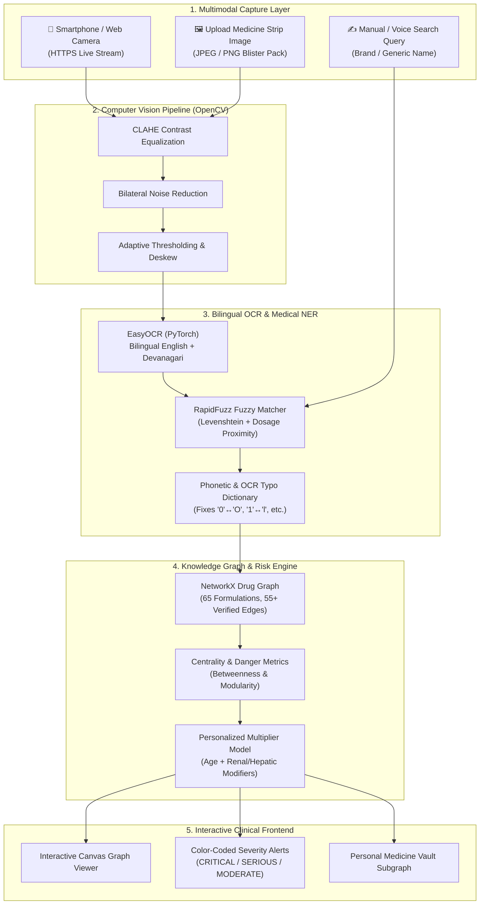

# 💊 MedLens — AI-Powered Medication Safety & Interaction Intelligence

<div align="center">

[](https://python.org)
[](https://fastapi.tiangolo.com)
[](https://pytorch.org)
[](https://opencv.org)
[](https://github.com/JaidedAI/EasyOCR)
[](https://networkx.org)
[](LICENSE)

**An intelligent, bilingual medication verification and drug-drug interaction engine combining Computer Vision, Medical Entity Extraction, and Knowledge Graph Analytics.**

*Designed for Indian Healthcare • Bilingual EN + HI Strip Scanning • 65 Essential Indian Drugs • Personalized Polypharmacy Risk Model*

</div>

---

## 📌 Problem & Clinical Motivation

In India and developing healthcare ecosystems, **over-the-counter (OTC) drug availability, self-medication, and unmonitored polypharmacy** create severe clinical vulnerabilities:
- **High Interaction Risk:** Millions of elderly patients take 4+ concurrent medications for hypertension, diabetes, and pain without centralized pharmacy records.
- **Packaging Ambiguity:** Indian medicine strips frequently feature bilingual text (Hindi + English), abbreviated brand names, low-contrast blister foil, and tiny typography that causes patient confusion.
- **Accidental Contraindications:** Combining common NSAIDs (like Diclofenac) with blood thinners (like Warfarin) or ACE inhibitors triggers acute gastrointestinal bleeding and renal failure.

**MedLens** transforms any smartphone or webcam into a clinical-grade drug safety scanner: automatically detecting medicine packaging, extracting active chemical compounds, evaluating your personal medication vault against a knowledge graph, and alerting you to severe contraindications.

---

## 🏛️ System Architecture



---

## ✨ Core Technological Innovations

### 1. 📷 Multi-Strategy Computer Vision Preprocessing
Blister packs and foil strips are notoriously hard for standard OCR due to glare, metallic reflection, and curved surfaces. MedLens applies a 4-pass OpenCV pipeline:
- **Contrast Limited Adaptive Histogram Equalization (CLAHE):** Balances reflective hotspots on foil strips.
- **Bilateral Filtering:** Removes high-frequency surface noise while preserving sharp font boundary edges.
- **Adaptive Gaussian Thresholding:** Isolates black and red medical printing on noisy backgrounds.

### 2. 🔍 Noise-Tolerant Medical Named Entity Recognition (NER)
OCR on wrinkled or cut medicine strips frequently introduces character swaps. MedLens uses a multi-signal scoring algorithm:
- **Weighted Token Distance:** RapidFuzz token set ratio with penalty for missing active salt suffixes.
- **Dosage Proximity Weighting:** Boosts match confidence when numeric concentrations (`500mg`, `50mcg`, `5ml`) align with clinical database formulations.
- **Bilingual Hindi Transliteration Support:** Recognizes common Indian brand names printed in Devanagari script.

### 3. 🕸️ Graph-Theoretic Interaction Analytics
Drug interactions are modeled as a weighted undirected graph $G = (V, E)$:
- **Vertices ($V$):** Active pharmaceutical ingredients categorized across 8 therapeutic classes.
- **Edges ($E$):** Verified pharmacological interactions classified into `CRITICAL`, `SERIOUS`, `MODERATE`, and `MINOR`.
- **Topological Danger Scoring:** Computes **Betweenness Centrality** to identify "gateway" medications (e.g., Warfarin, Methotrexate) that pose catastrophic cross-reaction risks across multiple drug families.
- **Personalized Patient Subgraph:** Extracts the induced subgraph $G[S]$ for the patient's active vault $S$, computing localized density and multi-drug interaction clusters.

### 4. 🧮 Personalized Polypharmacy Risk Function
$$\text{Risk Score} = \min\left(100, \left(\sum_{i,j \in S} w(e_{ij})\right) \times \mu_{\text{poly}}(|S|) \times \alpha_{\text{age}} \times \prod_{c \in C} \gamma_c\right)$$

- $w(e_{ij})$: Base severity weight (Critical = 40, Serious = 20, Moderate = 10, Minor = 5).
- $\mu_{\text{poly}}(|S|)$: Non-linear multiplier scaling rapidly when concurrent medications $|S| \ge 3$.
- $\alpha_{\text{age}}$: Demographic sensitivity factor (e.g., $1.35\times$ for pediatric or geriatric cohorts).
- $\gamma_c$: Pre-existing organ impairment modifiers (Liver, Kidney, Cardiovascular, Diabetes, Pregnancy).

---

## 📊 Knowledge Graph & Drug Coverage

MedLens catalogs **65 high-frequency Indian formulations** spanning all major chronic and acute therapies:
- **Analgesics & Anti-inflammatories:** Paracetamol, Ibuprofen, Diclofenac, Tramadol, Etoricoxib, Aceclofenac.
- **Cardiovascular & Anticoagulants:** Amlodipine, Atorvastatin, Losartan, Telmisartan, Metoprolol, Warfarin, Clopidogrel.
- **Antidiabetic Regimens:** Metformin, Glimepiride, Sitagliptin, Dapagliflozin, Insulin Glargine.
- **Antimicrobials:** Amoxicillin, Azithromycin, Ciprofloxacin, Cefixime, Doxycycline, Levofloxacin.
- **Neuropsychiatric & Sedatives:** Fluoxetine, Sertraline, Escitalopram, Alprazolam, Clonazepam.
- **Gastrointestinal & Respiratory:** Omeprazole, Pantoprazole, Domperidone, Ondansetron, Montelukast, Salbutamol.

---

## 📡 REST API Reference

| Endpoint | Method | Payload / Query | Response Highlights |
|---|---|---|---|
| `/api/health` | `GET` | — | Microservice status, graph node/edge counts |
| `/api/drugs` | `GET` | `?category=Cardiac` | Catalog listing with dosages, indications, and sides |
| `/api/scan/image` | `POST` | `multipart/form-data` | Detected text bounding boxes, matched drug, confidence score |
| `/api/scan/text` | `POST` | `{"query": "Dolo 650"}` | Normalized entity extraction and salt breakdown |
| `/api/interactions/check` | `POST` | `{"candidate": "Warfarin", "vault": [...]}` | Direct interaction paths with candidate drug |
| `/api/interactions/matrix`| `POST` | `{"vault": ["Ibuprofen", "Warfarin"]}` | Complete adjacency matrix of active contraindications |
| `/api/risk/score` | `POST` | Patient profile + vault items | Composite risk index (0–100) with explainable risk breakdown |
| `/api/analytics/graph` | `GET` | — | Full NetworkX graph (nodes, edges, centrality scores) |
| `/api/analytics/vault-graph` | `POST` | `{"vault": [...]}` | Induced subgraph JSON ready for Canvas/D3 rendering |

---

## 🚀 Quickstart Guide

### 1. Clone & Setup Environment
```bash
git clone https://github.com/Vedag812/MedLens.git
cd MedLens

python -m venv venv
source venv/bin/activate  # On Windows: venv\Scripts\activate

pip install -r requirements.txt
```

### 2. Launch Local Server
```bash
# Start FastAPI backend with automatic hot-reloading
uvicorn backend.main:app --reload --port 8000
```
Visit **`http://localhost:8000`** to access the interactive web interface, or **`http://localhost:8000/docs`** for the Swagger API explorer.

### 3. Mobile Camera Testing over HTTPS
Mobile browsers require secure contexts (HTTPS) to access the device camera:
```bash
# Generate development SSL certificates
python generate_cert.py

# Launch server bound to local network
uvicorn backend.main:app --host 0.0.0.0 --port 8000 \
  --ssl-keyfile certs/key.pem --ssl-certfile certs/cert.pem
```
Connect your smartphone to the same Wi-Fi network and navigate to `https://<YOUR-LOCAL-IP>:8000`.

---

## 🧪 Automated Testing

Run the test suite to verify fuzzy matching tolerances, OCR parsing, and risk calculations:
```bash
pytest tests/ -v
```

---

## 👥 Authors & Recognition

- **Vedant Agarwal** ([@Vedag812](https://github.com/Vedag812))
- **Tanishka Poddar** ([@Tan1725](https://github.com/Tan1725))

## 📄 License

This project is licensed under the [MIT License](LICENSE).
